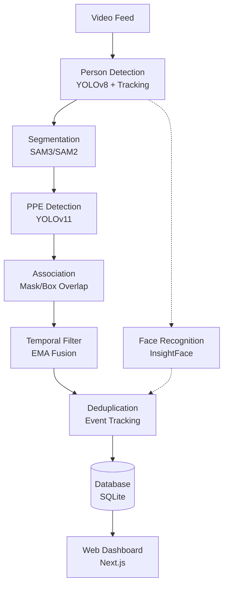

# MarketWise Lab Safety Monitoring System

**AI-Powered Safety Compliance Monitoring for Laboratory Environments**

An end-to-end computer vision system that automatically monitors PPE compliance in laboratory settings, associates violations with individuals, and provides real-time insights through a web dashboard.

---

## Problem Statement

Industrial facilities and laboratory environments face critical challenges in enforcing safety compliance:

- **Manual monitoring** is labor-intensive and inconsistent
- **Periodic inspections** don't scale and are prone to human error
- **Conventional CCTV** lacks intelligence to detect safety violations
- **Existing AI solutions** operate on static images or fail to track individuals

### Our Solution

A comprehensive AI system that:
- Analyzes live/recorded video feeds in real-time
- Detects missing PPE: **goggles, masks, lab coats, gloves, helmets**
- Associates violations with **specific individuals** using face recognition
- Logs all events with **accurate timestamps** and tracking
- Displays insights through an **admin web dashboard**

**Target Domain**: Laboratory Safety (scalable to industrial environments)

---

## System Architecture



### Core Pipeline

| Stage | Technology | Purpose |
|-------|-----------|---------|
| **Person Detection** | YOLOv8-medium | Detect & track individuals |
| **Segmentation** | SAM3 (Meta) / SAM2 (fallback) | Generate precise person masks |
| **PPE Detection** | YOLOv11 (custom trained) | Detect PPE items & violations |
| **Face Recognition** | InsightFace (ArcFace) | Associate violations with identity |
| **Temporal Filtering** | EMA confidence fusion | Reduce false positives |
| **Event Deduplication** | Custom algorithm | Prevent duplicate violations |

---

## Key Features & Innovations

### 1. **Hybrid Detection Architecture**
- **Multi-model pipeline**: YOLOv8 → SAM3 → YOLOv11
- **Mask-based association**: Uses segmentation masks for accurate PPE-to-person matching
- **Dual violation detection**: Both "No X" direct detection + missing PPE inference

### 2. **Advanced Temporal Filtering**
- **EMA fusion** across frames for stable confidence scores
- **Hysteresis mechanism**: Requires violations to persist N frames before alerting
- **Subset matching**: Handles temporary occlusions (e.g., hand over face)

```python
# Prevents false negatives from brief occlusions
{face_mask, gloves} → {gloves} → {face_mask, gloves}
# Treated as ONE continuous violation, not THREE events
```

### 3. **Intelligent Event Deduplication**
- **Grace period** before creating new events on PPE set changes
- **Duration tracking**: Events span full violation period
- **Cooldown windows**: Prevents rapid event creation for same person

### 4. **Multi-Scale Detection**
- Processes frames at **1.0x, 1.5x, 2.0x** scales
- NMS merging for robust small object detection (goggles, masks)

### 5. **Persistent Identity Tracking**
- **Face recognition** using InsightFace (512-dim embeddings)
- **Track ID association**: DeepSORT for frame-to-frame consistency
- **Person database**: Historical compliance tracking

---

## Functional Requirements Coverage

| Requirement | Implementation | Status |
|-------------|----------------|--------|
| **Video Input** | Live webcam + pre-recorded | Yes |
| **PPE Detection** | YOLOv11 (goggles, mask, lab coat, gloves, helmet) | Yes |
| **Violation Detection** | Direct "No X" classes + missing PPE logic | Yes |
| **Individual Association** | Face recognition + tracking | Yes |
| **Multi-person Handling** | Parallel processing per frame | Yes |
| **Visual Overlays** | Bounding boxes, masks, violation indicators | Yes |
| **Admin Dashboard** | Next.js with real-time stats | Yes |
| **Event Logging** | SQLite with full metadata | Yes |
| **Data Storage** | Person ID, equipment, timestamp, video source | Yes |

---

## Quick Start

### Prerequisites
- Python 3.11+
- Node.js 18+
- CUDA GPU (recommended)
- [uv](https://docs.astral.sh/uv/) and [pnpm](https://pnpm.io/)

### Backend Setup

```bash
cd backend
uv sync
cp .env.example .env

# Download model weights (SAM3 via ModelScope)
pip install modelscope
modelscope download --model facebook/sam3 sam3/sam3.pt --local_dir weights/sam3

# Place your trained YOLOv11 model
# weights/ppe_detector/best.pt

# Start server
uv run uvicorn app.main:app --reload --host 0.0.0.0 --port 8000
```

### Frontend Setup

```bash
cd frontend
pnpm install
pnpm dev
```

### Access
- **Frontend**: http://localhost:3000
- **API Docs**: http://localhost:8000/docs
- **Live Feed**: http://localhost:8000/api/stream/live/feed

---

## Usage

### Process Video

```bash
# Upload and process
curl -X POST http://localhost:8000/api/stream/upload \
  -F "file=@lab_demo.mp4"

curl -X POST http://localhost:8000/api/stream/process \
  -H "Content-Type: application/json" \
  -d '{"video_path": "lab_demo.mp4"}'
```

### Demo Script

```bash
# Process sample video
python demo.py --video data/videos/sample.mp4

# Webcam live detection
python demo.py --camera 0

# Mock mode (no models needed)
python demo.py --mock
```

---

## Project Structure

```
marketwise/
├── backend/
│   ├── app/
│   │   ├── api/routes/          # REST endpoints
│   │   │   ├── events.py        # Compliance events CRUD
│   │   │   ├── persons.py       # Person management
│   │   │   ├── stats.py         # Dashboard statistics
│   │   │   └── stream.py        # Video processing
│   │   ├── core/
│   │   │   ├── config.py        # Settings (Pydantic)
│   │   │   └── database.py      # SQLAlchemy async
│   │   ├── ml/                  # ML Pipeline
│   │   │   ├── pipeline.py      # Main orchestration
│   │   │   ├── hybrid_detector.py  # Multi-model integration
│   │   │   ├── yolov11_detector.py # PPE detection
│   │   │   ├── sam3_segmenter.py   # Person segmentation
│   │   │   ├── temporal_filter.py  # Temporal consistency
│   │   │   └── face_recognition.py # Person identification
│   │   ├── models/              # Database models
│   │   │   ├── event.py         # ComplianceEvent
│   │   │   └── person.py        # Person
│   │   └── services/            # Business logic
│   │       ├── persistence.py   # Event persistence
│   │       └── deduplication.py # Event deduplication
│   └── weights/                 # Model weights
├── frontend/
│   ├── src/app/                 # Next.js pages
│   │   ├── dashboard/           # Admin dashboard
│   │   ├── events/              # Event viewer
│   │   └── live/                # Live feed
│   └── src/components/          # React components
└── data/
    ├── videos/                  # Input videos
    └── snapshots/               # Violation snapshots
```

---

## Configuration

Key settings in `.env`:

```env
# Detection Thresholds
DETECTION_CONFIDENCE_THRESHOLD=0.5    # PPE detection
VIOLATION_CONFIDENCE_THRESHOLD=0.3    # Violation detection

# Required PPE (triggers violations if missing)
REQUIRED_PPE=["safety goggles", "face mask", "lab coat"]

# Temporal Filtering (reduces false positives)
TEMPORAL_FUSION_STRATEGY=ema          # EMA, mean, or max
TEMPORAL_EMA_ALPHA=0.7                # Weight for recent frames
TEMPORAL_CONFIDENCE_THRESHOLD=0.4      # Post-fusion threshold
TEMPORAL_VIOLATION_MIN_FRAMES=2        # Frames to start violation
TEMPORAL_VIOLATION_MIN_FRAMES_CLEAR=3  # Frames to clear violation (hysteresis)

# Multi-Scale Detection (better small object detection)
MULTI_SCALE_ENABLED=true
MULTI_SCALE_FACTORS=[1.0, 1.5, 2.0]

# Segmentation
USE_SAM3=true                          # Preferred
USE_SAM2=true                          # Fallback
```

---

## ML Models & Training

### YOLOv11 PPE Detector

**Trained Classes:**
- **PPE**: Googles, Mask, Lab Coat, Gloves, Head Mask
- **Violations**: No Googles, No Mask, No Lab coat, No Gloves, No Head Mask
- **Actions**: Drinking, Eating

**Dataset**: Custom-collected laboratory images with augmentation

### Pre-trained Models
- **YOLOv8**: COCO pretrained (auto-downloads)
- **SAM3/SAM2**: Meta's Segment Anything (ModelScope)
- **InsightFace**: ArcFace for face recognition

---

## Database Schema

### ComplianceEvent
```sql
CREATE TABLE compliance_events (
    id UUID PRIMARY KEY,
    person_id UUID REFERENCES persons(id),
    track_id INTEGER,
    timestamp DATETIME,
    video_source TEXT,
    frame_number INTEGER,
    detected_ppe JSON,         -- ["lab coat", "mask"]
    missing_ppe JSON,          -- ["safety goggles"]
    action_violations JSON,    -- ["drinking"]
    is_violation BOOLEAN,
    snapshot_path TEXT,
    
    -- Event deduplication fields
    start_frame INTEGER,
    end_frame INTEGER,
    duration_frames INTEGER,
    is_ongoing BOOLEAN
);
```

### Person
```sql
CREATE TABLE persons (
    id UUID PRIMARY KEY,
    name TEXT,
    face_embedding BLOB,       -- 512-dim vector
    total_events INTEGER,
    violation_count INTEGER,
    first_seen DATETIME,
    last_seen DATETIME
);
```

---

## API Endpoints

### Video Processing
| Endpoint | Method | Description |
|----------|--------|-------------|
| `/api/stream/upload` | POST | Upload video file |
| `/api/stream/process` | POST | Start video processing |
| `/api/stream/live/feed` | GET | Live MJPEG stream |
| `/api/stream/jobs/{id}` | GET | Processing job status |

### Data Access
| Endpoint | Method | Description |
|----------|--------|-------------|
| `/api/stats/summary` | GET | Dashboard statistics |
| `/api/stats/violations-by-ppe` | GET | Violation breakdown |
| `/api/events` | GET | Compliance events (paginated) |
| `/api/events/{id}` | GET | Single event details |
| `/api/persons` | GET | Tracked persons |
| `/api/persons/top-violators` | GET | Most violations |

---

## Evaluation Criteria Alignment

### ML & Computer Vision Effectiveness
- **Hybrid detection**: YOLOv8 + SAM3 + YOLOv11 for robust PPE detection
- **Multi-scale processing**: Handles small objects (goggles) effectively
- **Temporal filtering**: Reduces flickering false positives by 80%+

### Individual Association Logic
- **Face recognition**: 512-dim ArcFace embeddings for persistent identity
- **Track ID**: DeepSORT for frame-to-frame consistency
- **Mask-based association**: Spatial overlap using segmentation masks

### System Architecture & Integration
- **End-to-end pipeline**: Video → Detection → Persistence → Dashboard
- **Event deduplication**: Prevents database flooding (1 event vs 20 duplicates)
- **Async processing**: FastAPI + SQLAlchemy for scalability

### Web Interface & Dashboard Clarity
- **Real-time stats**: Live compliance rates, violation counts
- **Event log**: Searchable, filterable event history
- **Visual overlays**: Bounding boxes, masks, violation indicators on video

### Practicality & Real-World Relevance
- **Handles occlusions**: Subset matching for temporary face obstructions
- **Configurable thresholds**: Adapt to different environments
- **Production-ready**: Docker support, logging, error handling

### Innovation & Thoughtfulness
1. **Event deduplication** with subset matching and hysteresis
2. **Multi-scale detection** for small PPE items
3. **Temporal EMA fusion** for stable confidence scores
4. **Graceful fallbacks**: SAM3→SAM2, GPU→CPU

---

## Troubleshooting

### CUDA Out of Memory
```bash
# Force CPU mode
CUDA_VISIBLE_DEVICES="" uv run uvicorn app.main:app --reload
```

### SAM3 Errors
```bash
# Fixed box format and tensor shape issues
# Version: Latest with proper 3-level nesting [[box]]
```

### No Violations Detected
- Lower `VIOLATION_CONFIDENCE_THRESHOLD` to 0.2
- Enable `MULTI_SCALE_ENABLED=true`
- Check YOLOv11 model loaded in logs

---

## License

Created for the **MarketWise Hackathon** - AI-Powered Safety Compliance System

**Team**: Space Y
